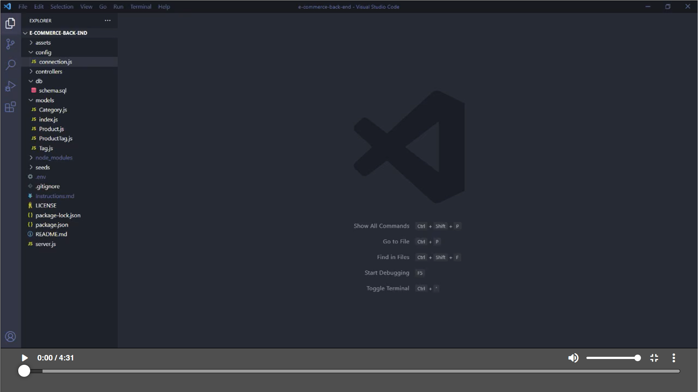

# e-commerce-back-end

[](https://opensource.org/licenses/MIT)

## Description

A Node.js back end for an e-commerce site. App is configured using a working Express.js API which utilises Sequelize to interact with the MySQL database.

The task was to develop this application by building on and modifying starter code, and provide a walkthrough that demonstrates the functionality by also testing various routes using Insomnia.

## Table of Contents

- [Description](#description)
- [Installation](#installation)
- [Usage](#usage)
- [Directory Structure](#directory-structure)
- [Technologies Used](#technologies-used)
- [Setup](#setup)
- [Demo](#demo)
- [Acknowledgements](#acknowledgements)
- [Questions](#questions)
- [License](#license)

## Installation

​Install dependencies using:

    npm install

## Usage

Login to mysql using the terminal using and the follow with your password:

    mysql -u root -p

The db schema will be added using the following:

```mysql
source .db/schema.sql

```

The application will then be invoked by using the following command:

    npm start

## Directory Structure

```md
.
├── assets/
├── config/
├── db/
├── models/
│ ├── Category.js
│ ├── Product.js
│ ├── Tag.js
│ ├── ProdcutTag.js
│ └── index.js
├── controllers/
│ ├── api/
| | ├── category-routes.js
| | ├── tag-routes.js
| | ├── product-routes.js
| | └── index.js
│ └── index.js
├── seeds/
├── .env
├── .gitignore
├── package.json
├── README.md
└── Server.js
```

## Technologies Used

- MySQL
- Express
- Node.js
- mysql2
- dotenv

## Setup

- Nodejs must be installed
- MySQL must be installed
- Insomnia is recommended to test routes
- MySQL Workbench (MySQL GUI recommended but not required)
- Text editor (VS Code recommended)

## Demo

[](https://watch.screencastify.com/v/J1ARaNg5oh2HtJBqz7RX)

## Acknowledgements

- https://www.npmjs.com/package/dotenv
- https://www.npmjs.com/package/express
- https://www.npmjs.com/package/mysql2
- https://www.npmjs.com/package/sequelize
- https://www.npmjs.com/package/nodemon

## Questions

Created by: [@moedaaboul](https://github.com/moedaaboul)

Feel free to contact me via [muhammad.daaboul1989@gmail.com](muhammad.daaboul1989@gmail.com)!

## License

This work is licensed under
[MIT](#).
